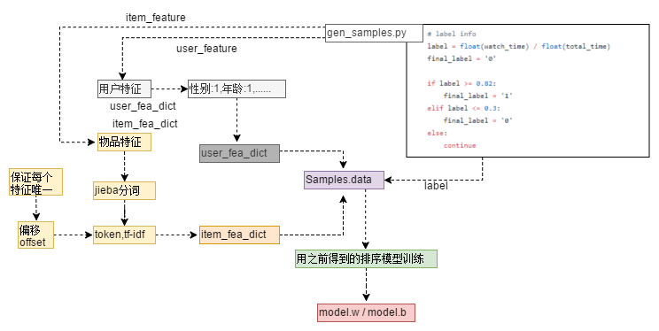

"# Music-recommendation-engine" 
"# 音乐推荐"
# 离线计算音乐推荐

## 笔记：

#### 1. **大致流程**
1. 解析请求：userid，itemid
2. 加载模型：加载 model.w ， model.b
3. 检索候选集合：分别用cb和cf去redis检索，得到 {item->item,item} 推荐候选
4. 获得用户特征：userid
5. 获得物品特征：itemid
6. 打分，排序： （sigmoid） => 1/（1 + exp（-wx）） / 1/（1 + exp（-wx + b））
7. 截取 top-n
8. 数据包装：{itemid-name}
9. 验证推荐

#### 2. 数据
1. 用户：userId / sex / age / inCome / region
2. 物品：itemId / itemName / itemDesc /  duration(时长) / region / tag（标签)
3. 用户行为：userid / itemid / user_item_duration / time（点击时间）
4. 融合：gen_base.py => merge_base.data
>解决方法：
>1. music元数据 => 字典
>2. 用户画像 => 字典
>3. 用户行为 => 解析userid,itemid => 拼接 => finish

#### 3.1 [召回] Content-Based ( CB => 基于内容的推荐 )
1. 希望输出：token，itemid，score形式
>token：借用jieba粉刺，对name等字段进行分词
2. 通过训练数据得到item，item相似矩阵
>1. **gen_cb_train.py**
>2. itemid去重
>3. 对字段分词
>4. 权重：{name:0.9,desc:0.1,tags:0.05}
>5. token字典：{token:item,score}
>6. Item-Item矩阵：{item1,item2,score}(MapReduce)
>6. **gen_reclist.py**
>7. cb_reclist.redis

#### 3.2 [召回] Collaborative Filtering ( CF => 协同过滤算法 )
1. 希望输出：userid，itemid，score
2. 通过训练数据得到item，item相似矩阵
>1. **gen_cf_train.py / merge_base.data**
>2. 字典 {userid,item : user_item_duration,duration}
>3. user:item 分数：user_item_duration / duration
>4. 字典 {userid,itemid,score}
>5. Item-Item矩阵：{item1,item2,score}(MapReduce)
>6. **gen_reclist.py**
>7. cf_reclist.redis

      key = '_'.join([userid, itemid])
        if key not in key_dict:
            key_dict[key] = []
        key_dict[key].append((int(watch_len), int(total_timelen)))
        
#### 4. 排序模型：sklearn
鸢尾花分类案例 => 获得排序模型
>**lr_iris.py**
X:花   y:分类(softmax)
1. （改）=> lr_out_model.py
2. （改）=> lr.py 
3. 维护了4个list { target_list:目标,每个样本标签 ， fea_row_list:行,row_index ， fea_col_list:列,feature  ， data_list:分数,score  }
4. numpy数组
5. import scipy.sparse 稀疏矩阵 csr_matrix
6. 训练集，测试集
7. model.w / model.b （二分类）

数据相关： 
- label,特征列表
- y(TAGS),X(样本)
> X -> model 预测 -> Y -> 排序

**权重：tf-idf值**

